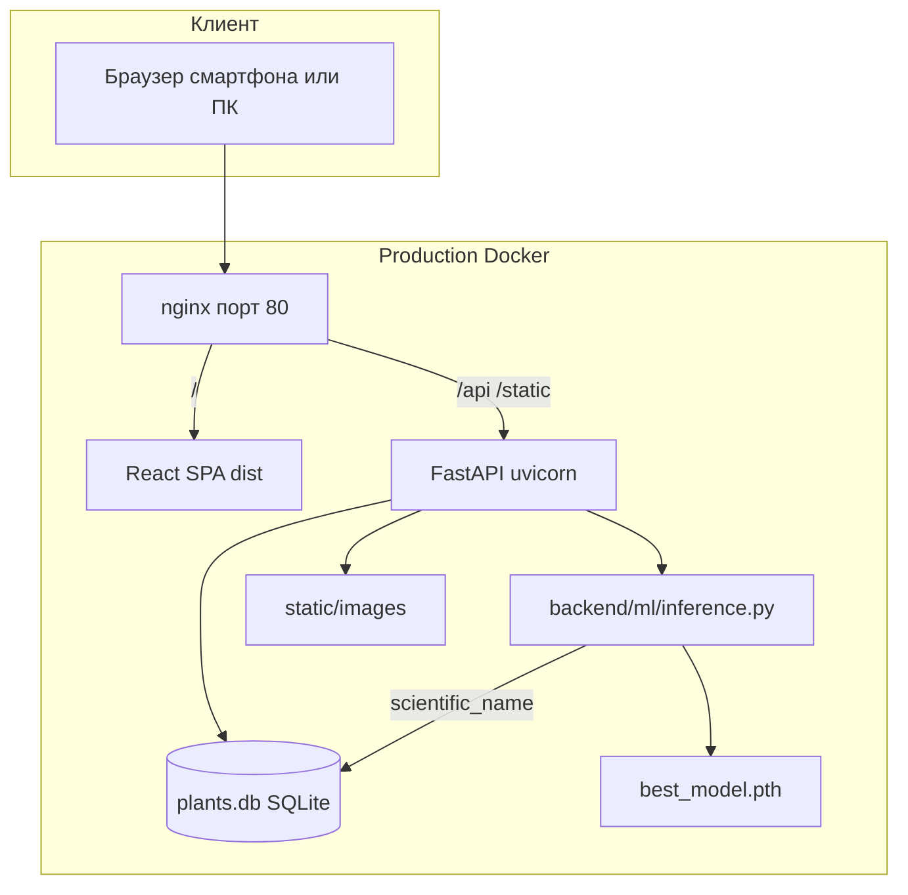
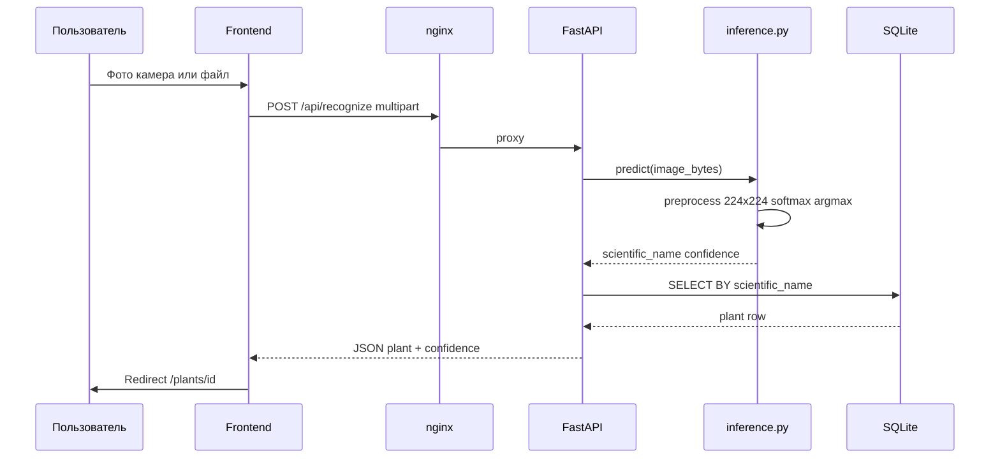

# flwrr — описание системы для защиты дипломной работы

Документ описывает веб-приложение **flwrr**: mobile-first справочник флоры РСО-Алания с автоматическим распознаванием растений по фотографии. Предназначен для подготовки к защите ВКР: архитектура, реализация, обоснование решений, границы MVP.

---

## Часть 1. Контекст и цели проекта

### 1.1. Назначение системы

**flwrr** — MVP-платформа для туристов и жителей региона, позволяющая:

1. Просматривать справочник характерных растений РСО-Алания (12 видов в текущей версии).
2. Искать растения по русскому названию и сортировать список по алфавиту.
3. Читать описание и **культурный контекст** (в том числе осетинские названия).
4. Загрузить фото или снять его камерой смартфона и получить результат **нейросетевой классификации** с переходом на карточку растения.

Регистрация и авторизация **не требуются** — пользователь сразу попадает на главную страницу со списком.

### 1.2. Целевая аудитория и UX-принципы

- **Mobile-first**: основной сценарий — использование в походе/на экскурсии через смартфон.
- **Минимальная навигация**: три экрана (список, карточка, распознавание) + плавающая кнопка (FAB).
- **Без барьера входа**: нет аккаунтов, форм регистрации, сложных меню.

### 1.3. Границы MVP относительно исходного ТЗ диплома

Исходное техническое задание предполагало PostgreSQL, отдельный ML-контейнер, статистику, партнёрский блок, CMS, top-3 предсказания, масштабирование на регионы. В **реализованном MVP** сознательно оставлено ядро:

| Реализовано | Не реализовано в коде (перспектива) |
|-------------|-------------------------------------|
| Справочник 12 растений | Таблицы регионов, категорий, локализаций |
| Поиск и сортировка | Статистика запросов |
| REST API (FastAPI) | Админ-панель / CMS |
| ML inference (EfficientNet-B0) | Top-3 в UI |
| SQLite | PostgreSQL |
| Docker Compose + nginx | HTTPS (описан как следующий шаг) |
| Mobile UI + камера | PWA offline, партнёры |

Упрощения **не отменяют** защиту: они типичны для дипломного MVP и должны быть явно озвучены комиссии как инженерный компромисс «срок / объём / демонстрация работоспособности».

### 1.4. Вердикт: можно ли защищать в текущем виде?

**Да.** Система демонстрирует полный сквозной сценарий: данные → API → UI → ML → карточка. Для успешной защиты дополнительно нужны (в пояснительной записке, не обязательно в коде):

- ER-диаграмма и UML (компоненты, sequence распознавания).
- Метрики обучения модели из ноутбука (accuracy, confusion matrix).
- Живая или записанная демонстрация.
- Слайд «MVP vs перспектива».

### 1.5. Что ценно для комиссии / что второстепенно

| **Ценно — акцентировать** | **Второстепенно — не углубляться** |
|---------------------------|-------------------------------------|
| Архитектура client–server, REST | Конкретные CSS-отступы |
| Связка ML (`scientific_name`) ↔ БД | Debounce 300 ms в поиске |
| Transfer learning, EfficientNet-B0 | Содержимое `node_modules` |
| Mobile-first, сценарий распознавания | Отсутствующие модули (партнёры) — только как «будущее» |
| SQLite + обоснование для MVP | PostgreSQL в проде — в разделе перспектив |
| Docker-деплой | Детали conda vs venv, если не спросят |
| Предметная область (осетинские названия) | Внутренности форматирования `**bold**` в тексте |

---

## Часть 2. Архитектура системы

### 2.1. Логические компоненты



**Разделение ответственности:**

- **Frontend (React)** — отображение, маршрутизация, отправка HTTP-запросов.
- **Backend (FastAPI)** — бизнес-логика, доступ к БД, вызов ML, раздача статики.
- **ML-модуль** — только классификация изображения; текстовый контент хранится в БД отдельно.
- **SQLite** — справочник растений.
- **Файловое хранилище** — изображения в `static/images/{scientific_name}/`.

ML **логически отделён** (пакет `backend/ml/`), но в MVP работает **в том же процессе**, что и API — это упрощает деплой для диплома.

### 2.2. Sequence: распознавание растения



### 2.3. Два режима запуска

| Режим | Назначение | Frontend | Backend |
|-------|------------|----------|---------|
| **Development** | Разработка на ПК | `npm run dev` (:5173), proxy на :8000 | `uvicorn backend.main:app --reload` |
| **Production** | VPS, демо на сервере | Сборка в nginx (`npm run build`) | Docker, 1 worker, без reload |

В development Vite проксирует `/api` и `/static` на localhost:8000. В production запросы идут на **тот же хост** (nginx), переменная `VITE_API_URL` не задаётся.

### 2.4. Обоснование технологического стека

| Технология | Почему выбрана |
|------------|----------------|
| **React + Vite** | Быстрая разработка SPA, mobile-first, проще Next.js для MVP без SSR |
| **TypeScript** | Типизация API-моделей на клиенте |
| **FastAPI** | Современный Python API, автодокументация, async upload |
| **SQLite** | Нулевая настройка сервера БД, достаточно для 12 записей и диплома |
| **PyTorch + timm** | Совпадение с pipeline обучения в Jupyter |
| **EfficientNet-B0** | Transfer learning, баланс точности и размера модели |
| **Docker Compose** | Воспроизводимый деплой одной командой |

---

## Часть 3. Backend — описание по модулям

Структура каталога `backend/`:

```
backend/
  main.py           — точка входа FastAPI
  config.py         — пути к данным и модели
  database.py       — работа с SQLite
  schemas.py        — Pydantic-модели ответов API
  routers/
    plants.py       — справочник
    recognize.py    — распознавание
  ml/
    inference.py    — загрузка модели и predict
```

### 3.1. `backend/main.py`

**Назначение:** создание приложения FastAPI, подключение middleware и маршрутов.

**Ключевые элементы:**

- **`lifespan`** — при старте сравнивает множество классов модели (`class_names` из checkpoint) с `scientific_name` в БД. При расхождении пишет WARNING в лог (защита от «модель обучена на одном, справочник — на другом»).
- **CORS** `allow_origins=["*"]` — для development и MVP; в production с одним доменом через nginx CORS фактически не нужен, но не мешает.
- **`StaticFiles`** — монтирование `/static` → каталог `static/` (изображения растений).
- **Роутеры** `plants`, `recognize`.
- **`GET /api/health`** — healthcheck для Docker.

### 3.2. `backend/config.py`

**Назначение:** централизованные пути к ресурсам с поддержкой переменных окружения для Docker.

| Переменная | По умолчанию | Описание |
|------------|--------------|----------|
| `FLWRR_ROOT` | родитель каталога `backend/` | Корень проекта |
| `FLWRR_DB_PATH` | `{ROOT}/plants.db` | SQLite |
| `FLWRR_STATIC_DIR` | `{ROOT}/static` | Картинки |
| `FLWRR_MODEL_PATH` | `{ROOT}/best_model.pth` | Веса модели |

Локальная разработка работает без env. Docker задаёт `/app/...` явно в `docker-compose.yml`.

### 3.3. `backend/database.py`

**Назначение:** доступ к SQLite, бизнес-логика списка и поиска.

**Функции:**

| Функция | Поведение |
|---------|-----------|
| `list_plants(search, sort)` | Выборка всех растений; фильтр по подстроке в `russian_name` (без учёта регистра); сортировка asc/desc |
| `get_plant(plant_id)` | Полная карточка по ID |
| `get_plant_by_scientific_name(name)` | **Связка ML → справочник** после inference |
| `get_all_scientific_names()` | Множество имён для проверки при старте |

**Сортировка по русскому алфавиту:**

1. Попытка использовать locale (`ru_RU.UTF-8`, `Russian_Russia.1251`).
2. Fallback: ручной порядок кириллицы `CYRILLIC_ORDER` — важно для Windows, где locale часто недоступен.

**Решение:** сортировка в Python, а не `ORDER BY` в SQL — проще корректная кириллица на разных ОС.

### 3.4. `backend/schemas.py`

**Назначение:** контракты JSON для API (Pydantic v2).

| Модель | Поля |
|--------|------|
| `PlantListItem` | plant_id, scientific_name, image_url, russian_name, osetian_name |
| `Plant` | + general_info, cultural_info |
| `RecognizeResponse` | plant, confidence, scientific_name |

Разделение `PlantListItem` / `Plant` уменьшает объём JSON в списке (без длинных текстов описания).

### 3.5. `backend/routers/plants.py`

| Endpoint | Описание |
|----------|----------|
| `GET /api/plants?search=&sort=asc\|desc` | Список для главной страницы |
| `GET /api/plants/{plant_id}` | Детальная карточка; 404 если нет |

Query-параметр `sort` валидируется regex `^(asc|desc)$`.

### 3.6. `backend/routers/recognize.py`

| Endpoint | Описание |
|----------|----------|
| `POST /api/recognize` | `multipart/form-data`, поле `file` |

**Цепочка обработки:**

1. Проверка `content-type` — image/*.
2. Чтение байтов файла.
3. `predict(image_bytes)` → `scientific_name`, `confidence`.
4. `get_plant_by_scientific_name` → если None, 404 «не найдено в справочнике».
5. Ответ `RecognizeResponse`.

**Коды ошибок:** 400 (не изображение / пустой файл), 503 (нет файла модели), 500 (ошибка inference), 404 (класс не в БД).

### 3.7. `backend/ml/inference.py`

**Назначение:** production inference обученной модели.

**Архитектура модели:** `efficientnet_b0` (библиотека `timm`), `num_classes=12`, веса из `best_model.pth`.

**Формат checkpoint:**

```python
{
  "model_state_dict": ...,
  "class_names": ["Alchemilla", "Betonica macrantha", ...]  # 12 строк
}
```

**Preprocessing (совпадает с обучением):**

- `Resize((224, 224))`
- `ToTensor()`
- **Без** `Normalize` — критично совпадать с ноутбуком обучения.

**Inference:**

- `model.eval()`, `torch.no_grad()`
- `softmax` → `argmax` → top-1 класс
- Возврат `scientific_name` и `confidence` (вероятность класса)

**Паттерн singleton + `threading.Lock`:** модель загружается один раз при первом запросе; lock защищает от гонки при параллельных запросах (при 1 uvicorn worker достаточно).

**Расположение файла:** `best_model.pth` в **корне проекта** — артефакт production; каталог `ml_part/` — локальный архив обучения, не входит в GitHub.

### 3.8. `create_db.py`

**Назначение:** создание и наполнение SQLite.

- Таблица `plants` с 12 записями.
- `image_url` — относительные пути `/static/images/{scientific_name}/{file}.jpg`.
- `plant_id` — числовой ID (совпадает с taxon_id из iNaturalist, не используется моделью).
- **`scientific_name`** — ключ связи с ML.

Запуск: `python create_db.py` → пересоздаёт `plants.db`.

---

## Часть 4. База данных

### 4.1. ER-модель (текстовое описание)

В MVP одна сущность **Plant** (таблица `plants`). Нормализация по регионам/категориям отложена.

| Поле | Тип | Назначение |
|------|-----|------------|
| `plant_id` | INTEGER PK | Идентификатор в URL `/plants/{id}` |
| `scientific_name` | TEXT NOT NULL | Латинское имя; **класс ML** |
| `image_url` | TEXT | Путь к превью в справочнике |
| `russian_name` | TEXT | Название в списке и поиске |
| `osetian_name` | TEXT | Осетинское название |
| `general_info` | TEXT | Описание (может содержать `**жирный**`, `<br>`) |
| `cultural_info` | TEXT | Культурный блок; NULL если нет |

### 4.2. Классы модели (12 видов)

Список `class_names` в checkpoint (алфавит папок датасета):

1. Alchemilla  
2. Betonica macrantha  
3. Bistorta carnea  
4. Chamaenerion colchicum  
5. Gymnadenia conopsea  
6. Hippophae rhamnoides  
7. Phedimus spurius  
8. Pinus sylvestris hamata  
9. Rhododendron caucasicum  
10. Rhododendron luteum  
11. Salvia verticillata  
12. Veronica gentianoides  

Каждое имя должно иметь **ровно одну** строку в `plants` с тем же `scientific_name`.

---

## Часть 5. Frontend — описание по модулям

Структура `frontend/src/`:

```
src/
  main.tsx              — точка входа, BrowserRouter
  App.tsx               — маршруты + FAB
  api/client.ts         — HTTP-клиент
  pages/
    HomePage.tsx
    PlantDetailPage.tsx
    RecognizePage.tsx
  components/
    PlantListItem.tsx
    FloatingRecognizeButton.tsx
  utils/formatText.tsx
  index.css             — mobile-first стили
```

### 5.1. `App.tsx`

React Router маршруты:

| Путь | Компонент |
|------|-----------|
| `/` | HomePage — список |
| `/plants/:id` | PlantDetailPage |
| `/recognize` | RecognizePage |

`FloatingRecognizeButton` рендерится на всех страницах, **кроме** `/recognize`.

### 5.2. `HomePage.tsx`

- Заголовок **flwrr**, кнопка «Распознать».
- Поиск с **debounce 300 ms** → `GET /api/plants?search=...`.
- Кнопка сортировки переключает `sort=asc` / `desc` (подпись А→Я / Я→А).
- Список карточек через `PlantListItemCard`.

### 5.3. `PlantListItem.tsx`

Карточка строки: слева thumbnail (`image_url`), справа русское и осетинское название. Клик → `/plants/{plant_id}`.

`isMissingOssetian` — визуально приглушает текст «Нет осетинского названия».

### 5.4. `PlantDetailPage.tsx`

- Загрузка `GET /api/plants/{id}`.
- Крупное фото, русское / осетинское / латинское имя.
- Секции «Описание» и «Культурный контекст» с `formatPlantText`.

### 5.5. `RecognizePage.tsx`

- Скрытый `<input type="file" accept="image/*">`.
- **Mobile:** кнопки «Сделать фото» (`capture=environment`) и «Выбрать из галереи».
- **Desktop:** «Загрузить фото».
- Превью → «Отправить» → `POST /api/recognize` → redirect на карточку.

**Примечание:** API возвращает `confidence`, но UI **не показывает** вероятность — сразу переход на карточку. Это упрощение UX; значение доступно в JSON для будущего UI.

### 5.6. `FloatingRecognizeButton.tsx`

Fixed FAB в правом нижнем углу, SVG «цветок в рамке камеры», переход на `/recognize`.

### 5.7. `api/client.ts`

- `API_BASE = import.meta.env.VITE_API_URL ?? ""` — пустая строка в production (same-origin).
- Для теста с телефона в dev: `frontend/.env.local` с `VITE_API_URL=http://IP:8000`.
- `imageSrc()` — склеивает base + относительный путь картинки.

### 5.8. `utils/formatText.tsx`

Лёгкий рендер текста из БД без полноценного Markdown:

- `**текст**` → `<strong>`
- `_текст_` → `<em>`
- `<br>` → перенос строки

### 5.9. `index.css` — mobile-first

- `max-width: 480px` у `.app-shell` — имитация телефона на desktop.
- Touch targets ≥ 44px.
- FAB с `safe-area-inset-bottom` для iPhone.
- Зелёная природная палитра CSS-переменных.

### 5.10. `vite.config.ts`

- Dev: proxy `/api`, `/static` → `127.0.0.1:8000`.
- Build: `outDir: 'dist'` для nginx.

---

## Часть 6. ML-подсистема (обучение и inference)

### 6.1. Pipeline обучения (ваша работа, ноутбук)

Описывается в **пояснительной записке**, исходники — локально в `ml_part/` (не в GitHub):

1. **Сбор данных:** iNaturalist, наблюдения региона, ~15 топ-классов → 12 финальных.
2. **Очистка:** удаление дубликатов, нерелевантных кадров.
3. **Разбиение:** train / validation / test (ImageFolder).
4. **Модель:** EfficientNet-B0, transfer learning (`timm`, `pretrained=True` при обучении).
5. **Оптимизация:** AdamW, early stopping.
6. **Метрики:** accuracy, classification_report, confusion matrix — **приложить к ВКР**.
7. **Экспорт:** `best_model.pth` с `model_state_dict` и `class_names`.

### 6.2. Pipeline inference (код production)

См. `backend/ml/inference.py` — загрузка checkpoint, preprocess, top-1.

**Принцип разделения:** модель отвечает только за **класс изображения**; тексты, культурный контекст, переводы — в БД. Это позволяет обновлять контент без переобучения.

### 6.3. Связка ML ↔ справочник

```
class_names[i] == plants.scientific_name
```

Модель **не возвращает** `plant_id` — только строку латинского имени. Backend выполняет SQL lookup. Так проще согласовать переобучение модели и правки справочника.

---

## Часть 7. Деплой и эксплуатация

### 7.1. Docker Compose

Файл `docker-compose.yml`:

| Сервис | Роль |
|--------|------|
| **backend** | FastAPI, порт 8000 только внутри сети Docker |
| **nginx** | Порт 80 наружу, статика + reverse proxy |

**Volumes (данные на хосте):**

- `./plants.db`
- `./static` (read-only)
- `./best_model.pth` (read-only)

**Healthcheck backend:** HTTP GET `/api/health`, `start_period: 120s` (время на загрузку torch/модели).

**Лимит памяти:** 2 GB — PyTorch CPU + модель.

### 7.2. nginx

- `/` → SPA, `try_files` для React Router.
- `/api/` → proxy на backend, timeout 120s для распознавания.
- `/static/` → proxy на backend (FastAPI StaticFiles).
- `client_max_body_size 10M` — загрузка фото.

### 7.3. Требования VPS

- Ubuntu 22.04+, 2 GB RAM, 20–30 GB SSD, порт 80.
- GPU не требуется.

Подробная инструкция: `DEPLOY.md`.

### 7.4. Локальная разработка (без Docker)

```powershell
conda activate flora
$env:KMP_DUPLICATE_LIB_OK="TRUE"   # при ошибке OpenMP conda+torch
uvicorn backend.main:app --reload --host 0.0.0.0 --port 8000

cd frontend && npm run dev
```

---

## Часть 8. REST API — справочник

### 8.1. Endpoints

#### `GET /api/health`

```json
{"status": "ok"}
```

#### `GET /api/plants?search=род&sort=asc`

Ответ: массив `PlantListItem`.

#### `GET /api/plants/546910`

Ответ: объект `Plant` или 404.

#### `POST /api/recognize`

Request: `multipart/form-data`, поле `file` (JPEG/PNG).

Response 200:

```json
{
  "plant": { "plant_id": 546910, "scientific_name": "Rhododendron caucasicum", ... },
  "confidence": 0.87,
  "scientific_name": "Rhododendron caucasicum"
}
```

### 8.2. Коды ошибок

| Код | Когда |
|-----|-------|
| 400 | Не image/* или пустой файл |
| 404 | Растение не найдено / класс не в справочнике |
| 503 | Нет `best_model.pth` |
| 500 | Ошибка inference |

---

## Часть 9. Принятые решения и компромиссы

### 9.1. SQLite вместо PostgreSQL

**За:** нулевая настройка, один файл, достаточно для 12 записей и дипломной демонстрации.  
**Против:** нет конкурентной записи, масштабирование на множество регионов сложнее.  
**Вывод:** для MVP оправдано; миграция на PostgreSQL — смена DSN и драйвера, схема таблицы `plants` переносится напрямую.

### 9.2. Top-1 вместо top-3

**За:** проще UX — сразу карточка.  
**Против:** при ошибке модели пользователь не видит альтернатив.  
**Вывод:** API уже возвращает одну пару (name, confidence); top-3 — расширение response и UI.

### 9.3. ML в процессе backend

**За:** один контейнер, один деплой, меньше RAM чем 2× PyTorch.  
**Против:** нельзя масштабировать ML отдельно.  
**Вывод:** модуль `backend/ml/` готов к выносу в отдельный серvice с тем же HTTP-контрактом.

### 9.4. Нет авторизации, статистики, CMS

Соответствует сценарию «открыл и пользуйся». Контент правится через `create_db.py` или прямой SQL. Для коммерческого продукта потребовались бы admin API и analytics.

### 9.5. CORS `*`

Удобно при dev (frontend :5173, backend :8000). В production через nginx same-origin проблемы нет.

---

## Часть 10. Что не акцентировать на защите

- Реализация `formatPlantText` построчно.
- Выбор debounce 300 ms vs 200 ms.
- Содержимое `node_modules`, lock-файлы.
- Отсутствие PostgreSQL как «недоработка» — формулировать как **осознанный scope MVP**.
- Папка `ml_part/` в репозитории — только локальный архив обучения.

---

## Часть 11. Сценарий демонстрации на защите (5–7 минут)

### 11.1. Подготовка

- [ ] Backend запущен (`uvicorn` или Docker).
- [ ] Frontend доступен (localhost:5173 или http://IP).
- [ ] `best_model.pth` и `plants.db` на месте.
- [ ] 2–3 тестовых фото растений из 12 классов (с телефона или заранее).
- [ ] Запасной план: скриншоты/видео при сбое Wi‑Fi.

### 11.2. Сценарий

1. **Главная (30 с):** показать бренд flwrr, 12 карточек, фото, русские и осетинские названия.
2. **Поиск (20 с):** ввести «рододендрон» — фильтрация списка.
3. **Сортировка (10 с):** переключить Я→А.
4. **Карточка (40 с):** открыть растение, описание, культурный контекст, латинское имя.
5. **Распознавание (2 мин):** FAB или «Распознать» → фото → отправка → переход на карточку. Проговорить: «модель вернула scientific_name, backend нашёл запись в SQLite».
6. **Архитектура (1 мин):** слайд или устно: React → REST → FastAPI → PyTorch + SQLite.
7. **Деплой (30 с):** упомянуть Docker Compose, 2 GB RAM, `DEPLOY.md`.

### 11.3. Запасной план

- Docker на ноутбуке: `docker compose up`, http://localhost.
- Статичные скриншоты в презентации.
- Показ `/api/health` и JSON `/api/plants` в браузере.

---

## Часть 12. Типичные вопросы комиссии и ответы

**Почему SQLite, а не PostgreSQL?**  
Для MVP с 12 записями и read-heavy нагрузкой SQLite достаточен и упрощает развёртывание. Архитектура допускает замену слоя данных без изменения frontend.

**Как связаны модель и справочник?**  
По полю `scientific_name`. Модель классифицирует изображение в один из 12 латинских имён; backend выполняет SELECT и отдаёт полную карточку из БД.

**Почему EfficientNet?**  
Transfer learning на готовых весах ImageNet; быстрое обучение на небольшом региональном датасете, приемлемая точность на CPU.

**Сколько памяти нужно серверу?**  
Около 2 GB RAM из-за PyTorch и модели; в compose задан лимит.

**Почему top-1, а не top-3?**  
Упрощение UX для MVP; API и модель можно расширить до top-k без смены архитектуры.

**Где статистика и админка?**  
Вне scope MVP; контент через `create_db.py`, статистика — перспектива.

**Как обеспечивается mobile-first?**  
Viewport meta, max-width контейнера, крупные кнопки, FAB, `capture` для камеры на iOS/Android.

**Что если модель ошиблась?**  
Пользователь видит одну карточку; улучшения — top-3, порог confidence, сбор обратной связи (перспектива).

**Почему ML не в отдельном контейнере?**  
Упрощение дипломного деплоя; код выделен в `backend/ml/` для будущего выноса.

---

## Часть 13. Перспективы развития

1. **Top-3** предсказаний с выбором пользователя.
2. **ONNX Runtime** вместо полного PyTorch — меньше RAM на VPS.
3. **PostgreSQL** + таблицы регионов, категорий, локализаций.
4. **Статистика** распознаваний и популярных видов.
5. **HTTPS** (Let's Encrypt) + домен.
6. **Админ-панель** для контента.
7. **Партнёрский блок** (экскурсии, кафе).
8. **PWA** для offline-справочника.
9. **Отдельный ML-сервис** при росте нагрузки.

---

## Часть 14. Структура репозитория (итог)

```
VKR_project/
  backend/              Python API + ML inference
  frontend/             React SPA
  docker/               Dockerfile backend, nginx
  static/images/        Фото растений (12 папок)
  best_model.pth        Production-модель (не в git)
  plants.db             SQLite (не в git)
  create_db.py          Инициализация БД
  docker-compose.yml    Production-оркестрация
  requirements.txt      Python-зависимости (dev)
  README.md             Быстрый старт
  DEPLOY.md             Деплой на VPS
  DIPLOMA_SYSTEM.md     Этот документ
  ml_part/              Локальный архив обучения (не в git)
```

---

*Документ подготовлен для защиты дипломной работы по проекту flwrr. Актуальность кода проверяйте по файлам репозитория; метрики ML приводите из вашего ноутбука обучения.*
